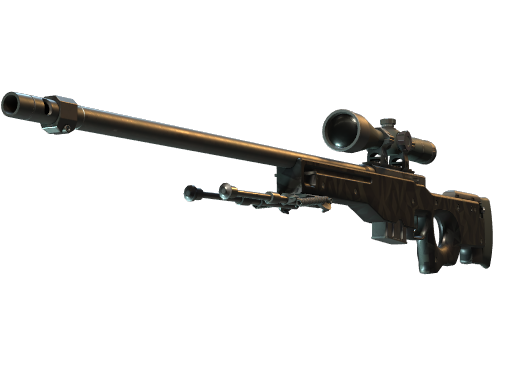

# CS2 Memory Game

A memory card matching game featuring Counter-Strike 2 weapon images. Test your memory by matching pairs of CS2 weapon cards in this interactive web game built with Vue 3, TypeScript, and Pinia.



## Features

- **Interactive Memory Card Game** - Match pairs of CS2 weapon cards
- **Game Controls** - Start a new game, adjust difficulty, and track your progress
- **Game History** - View your past game scores
- **Sound Effects** - Enjoy audio feedback when flipping cards, matching pairs, and winning
- **Internationalization** - Available in English and Polish
- **Responsive Design** - Play on most devices (Desktop recommended for best experience)

## Tech Stack

- Vue 3 with Composition API
- TypeScript
- Pinia for state management
- Vue I18n for internationalization
- Vitest for unit testing

## Installation

```sh
# Install dependencies
yarn

# Compile and hot-reload for development
yarn dev

# Type-check, compile and minify for production
yarn build
```

## Game Instructions

1. Start a new game using the game controls
2. Click on cards to flip them and reveal CS2 weapons
3. Match pairs of identical weapon cards
4. Complete all pairs to win the game
5. Try to win with the fewest moves possible!

## Testing

```sh
# Run tests
yarn test

# Run tests with coverage
yarn test:coverage

# Run tests in watch mode
yarn test:watch
```

## Folder Structure

- `/public` - Static assets like images and sounds
- `/src` - Source code
  - `/components` - Vue components
  - `/stores` - Pinia store for game state
  - `/services` - Game services (sound)
  - `/i18n` - Internationalization
  - `/types` - TypeScript type definitions

## License

MIT
